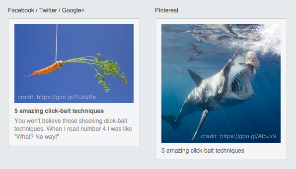
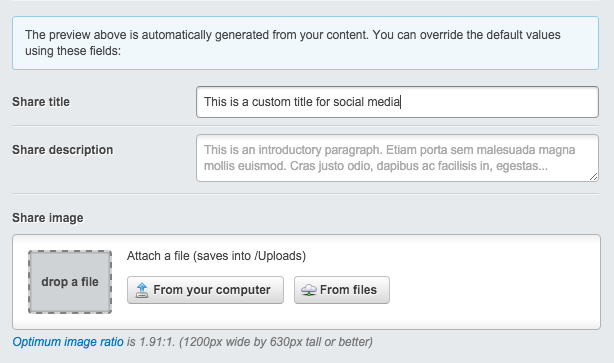
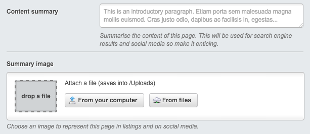

# Share Care for SilverStripe

When URLs are shared on social media a rich preview of the content may be
generated to give the URL context. The goal of this module is to encourage CMS
users to be aware of how their content will appear when shared, and give them
tools to customise this appearance.



## Requirements

- SilverStripe ^4.0
- [SilverStripe Opengraph module](https://github.com/tractorcow/silverstripe-opengraph)

## Installation

See the [Packagist listing](https://packagist.org/packages/jonom/silverstripe-share-care) and [composer installation instructions](http://doc.silverstripe.org/framework/en/installation/composer#adding-modules-to-your-project).

1. `$ composer require jonom/silverstripe-share-care`
2. Flush manifests by visiting /dev/build

## How to use

### View rich share previews in the CMS

With the module installed you should find a Share tab on all pages
which shows you roughly what each page will look like when shared on social
media. The preview is based upon the output of the Opengraph module, so your
configuration of that module will be reflected here.

To add share previews to other DataObject classes, just add the
`ShareCare` extension to them. Example:

```yml
---
Name: mysharecare
After: 'opengraphextensions'
---
MyDataObject:
  extensions:
    - JonoM\ShareCare\ShareCare
```

See the [SilverStripe documentation](https://docs.silverstripe.org/en/developer_guides/extending/extensions/) for more info on extensions.

### Customise the appearance of content on social media

You can configure the Opengraph module to generate open graph tags however you
like, and this is what controls the appearance of rich previews on social
media (especially Facebook and Twitter). To quickly configure the Opengraph
module to allow CMS users to customise the content and appearance of these
previews, just add the `ShareCareFields` extension to your Page class (and any
other classes you like).



Example configuration:

```yml
---
Name: mysharecare
After: 'opengraphextensions'
---
Page:
  extensions:
    - JonoM\ShareCare\ShareCareFields
```

This allows CMS users to customise the image, title and description that are
shown when a URL is shared on social media. You can further tweak these
behaviours by overriding functions on your classes. For example if each page
on your website already contains a Hero Image, you may want to override
`getDefaultOGImage()` to use this as the default image:

```php
/**
 * Provide a better default OG image for pages
 */
public function getDefaultOGImage() {
	// Use hero image if available
	if ($this->HeroImageID) {
		return $this->HeroImage();
	}
	// Fallback to website's apple-touch-icon
	if (file_exists(BASE_PATH . '/apple-touch-icon.png')) {
		return Director::absoluteURL('apple-touch-icon.png', true);
	}
}
```

*Note that `og:image` is a [required property](http://ogp.me/), so please ensure
that `getDefaultOGImage()` will always work. If your website includes an
apple-touch-icon.png file in the root you'll be covered.*

#### Don't need that much control?

As an alternative to the `ShareCareFields` extension, try taking the
`ShareCareSingleSummary` extension for a spin. This opinionated extension
lets CMS users choose a single image and a single summary to be used to
represent a page within the website and on search engines and social media.
It puts the fields front and centre above the main content field to encourage
CMS users to actually fill them out. As a bonus it also hides that pesky
'custom meta tags' field away in the Settings tab.



Example configuration:

```yml
---
Name: mysharecare
After: 'opengraphextensions'
---
Page:
  extensions:
    - JonoM\ShareCare\ShareCareSingleSummary
```

### Twitter integration

Markup for a [large image summary](https://dev.twitter.com/cards/types/summary-large-image)
Twitter card  will be included if a large enough image is provided. To attribute
content ownership set a Twitter username in your config.yml file. Example:

```yml
JonoM\ShareCare\ShareCare:
  twitter_username: 'your-username'
```

Don't want Twitter card markup? Disable it like so:

```yml
JonoM\ShareCare\ShareCare:
  twitter: false
```

Note that Twitter will still use your open graph tags to produce a rich preview
if this feature is disabled.

### Share links

You can use these methods in your templates to get a convenient share URL
for each service

- `$FacebookShareLink`
- `$TwitterShareLink`
- `$PinterestShareLink`
- `$LinkedInShareLink`
- `$EmailShareLink`

#### Pinterest CMS integration

If you're making use of the `ShareCareFields` extension and $PinterestShareLink, you can
include a Pinterest preview in the CMS and allow CMS users to set a different image for
Pinterest, as tall rather than wide images are better suited to this service.

```yml
JonoM\ShareCare\ShareCare:
  pinterest: true
```

## Maintainer contact

[jonathonmenz.com](http://jonathonmenz.com)
